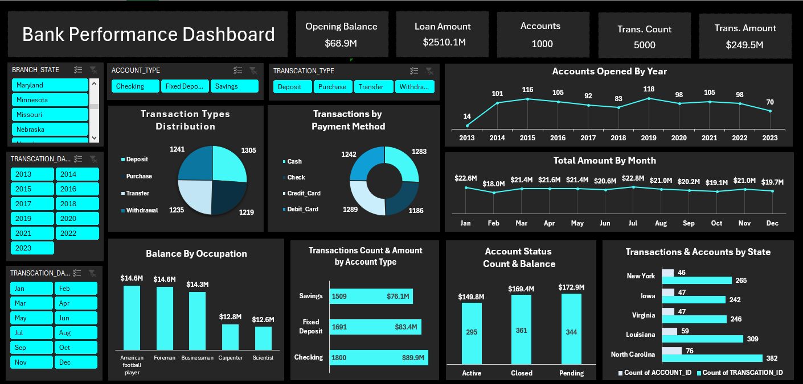

# Bank Performance Analysis

## Project Objective

This project is an exploratory data analysis (EDA) of a bank's operational data. The goal was to understand patterns and trends across customers, accounts, transactions, branches, and loans — without focusing on a specific business problem. It is part of a Data Analyst portfolio to showcase skills in data cleaning, analysis, and visualization using Excel.

---

## Dataset Description

The data provides a complete view of banking operations, allowing analysis of customer activity, account performance, transaction patterns, lending operations, and regional branch performance. With over 7,500 records across different business areas.

---

## Tools Used

- **Microsoft Excel** — data cleaning, pivot tables, and dashboard
- **Power Query** — data transformation and formatting

---

## Data Cleaning

- Fixed date columns — transaction dates and account open dates were formatted properly
- Corrected the DOB column which was stored as Excel serial numbers instead of real dates
- Verified all ID columns are unique — no duplicates found
- Checked all tables for missing values — none were found
- Standardized column names to be consistent across all sheets

---

## Exploratory Data Analysis

### Accounts

Accounts are split across Checking (36%), Fixed Deposit (33.6%), and Savings (30.4%). Interestingly, more accounts are Closed (36%) than Active (29.5%), which raises questions about customer retention.

### Transactions

5,000 transactions were analyzed across 11 years (2013–2023). All four transaction types (Deposit, Withdrawal, Transfer, Purchase) are nearly equally distributed at around 25% each. The same balance applies to payment media — Cash, Credit Card, Debit Card, and Check are all used at similar rates.

### Customers

1,000 customers spread across 945 unique cities with 55 different occupations. Top occupations by opening balance include Businessman, Scientist, and Foreman.

### Loans

500 loan records with amounts ranging from approximately $51K to $10M. Total loan portfolio value is $2,510,070,135.

### Branches

50 branches across multiple U.S. states. North Carolina and Louisiana are the top states by transaction count and account activity.

---

## Key Insights

- More accounts are closed than active — potential churn worth investigating
- All transaction types and payment methods are evenly distributed
- Total transaction amount reached $249,456,590 across all records
- The loan portfolio ($2.51B) is significantly larger than total opening balances ($492M)
- Transaction volumes are consistent month to month with no major seasonal spikes
- The customer base is highly diverse across cities and occupations

---

## Conclusion

This analysis provides a high-level view of banking operations across customers, accounts, transactions, and loans. It highlights key behavioral patterns and operational metrics that can support better decision-making in customer retention and financial analysis.

---
